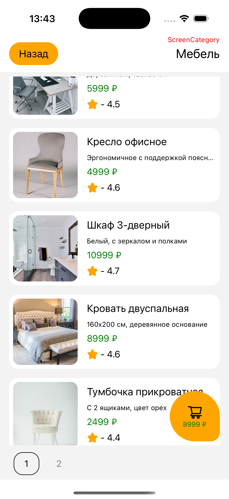

# Тестовое задание для D2C

## Предварительные требования

Node.js (v14 или выше)
npm (v6 или выше)
React Native CLI
Xcode (для iOS)
Android Studio (для Android)

## Установка

- Клонировать репозиторий
> git clone https://github.com/shellipov/D2C.git

- npm ci
- react-native start - запустить metro

### iOS

- cd ios && pod install
- npm run ios-open - открыть проект в XCode
- выбрать симулятор, Run

### Android

- открыть эмулятор в Android Studio
- запустить react-native run-android

### Приложение написано в соответствии с задачей https://docs.google.com/document/d/1DRror8Rbj9xc8NJMXVosGVwdqY9k4uQ-gBrFrz71qss/edit?usp=sharing

  Скриншоты приложения

     

